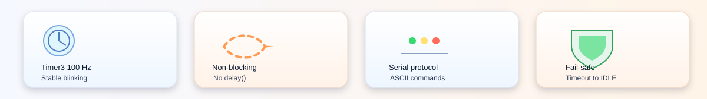
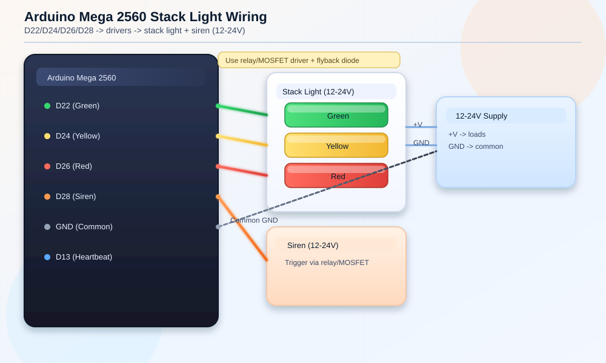

<p align="center">
  
</p>
<p align="center">
  
</p>

# TungLamvsNodeMega2560
Stack Light + Siren Controller for Arduino Mega 2560

> Non-blocking, timer-driven stack light controller with a simple serial protocol (Serial0/USB).

## Overview
This project drives a 3-color stack light and a siren from an Arduino Mega 2560. It listens to
line-based ASCII commands over Serial0 (USB), applies a robust state machine, and stays responsive
thanks to a 100 Hz Timer3 ISR (no `delay()` in the main loop).

## Highlights
- Timer3 @ 100 Hz handles blinking and beep timing (stable, non-blocking).
- Line-based serial parser with ACK/ERR responses and a timeout failsafe.
- READY/RUN/CANCELED/SUCCEEDED/FAIL states mapped to lamp patterns.
- Manual control commands for testing (SIREN, BEEP, SET).

## Hardware
### Pin map
| Function | Arduino Mega pin | External device |
| --- | --- | --- |
| Green lamp | D22 | Stack light green channel via relay/MOSFET |
| Yellow lamp | D24 | Stack light yellow channel via relay/MOSFET |
| Red lamp | D26 | Stack light red channel via relay/MOSFET |
| Siren | D28 | Siren via relay/MOSFET |
| Heartbeat | D13 | On-board LED (built-in) |
| GND | GND | Common ground with external supply |

### Wiring diagram


### Wiring notes
- Stack light and siren are typically 12-24 V loads. Use a relay or MOSFET driver and a flyback diode.
- Do NOT connect 12-24 V directly to Arduino pins.
- All grounds must be common: Arduino GND <-> driver GND <-> power supply GND.
- `ACTIVE_LEVEL` is set to `HIGH`. If your driver is active-low, change it to `LOW`.

## State mapping
| State | Green | Yellow | Red | Siren |
| --- | --- | --- | --- | --- |
| IDLE | OFF | OFF | OFF | OFF |
| READY | ON | OFF | OFF | OFF |
| RUN | BLINK SLOW (anti-phase) | BLINK SLOW (anti-phase) | OFF | OFF |
| CANCELED | OFF | ON | OFF | OFF |
| SUCCEEDED | BLINK FAST | OFF | OFF | OFF |
| FAIL | OFF | OFF | BLINK FAST | ON |

## Serial protocol
### Basics
- Baud rate: `115200`
- Line endings: `\n` or `\r`
- Case-insensitive (input is normalized to uppercase)

### Commands
```
IDLE | READY | RUN | CANCELED | SUCCEEDED | FAIL
STATE:<state>                     (same as above)
SIREN ON | SIREN OFF
BEEP <ms>
SET <COLOR> <ON|OFF|BLINK> [period_ms]   (COLOR: GREEN|YELLOW|RED)
```

### Responses
- `ACK:STATE=...`, `ACK:SIREN=...`, `ACK:BEEP=...`, `ACK:SET ...`
- `ACK:BEEP_DONE` when a timed beep finishes
- `ERR:...` for invalid commands

## Defaults and timing
| Parameter | Value |
| --- | --- |
| `SERIAL_BAUD` | 115200 |
| `LINK_TIMEOUT_MS` | 5000 (no commands => IDLE) |
| `HEARTBEAT_MS` | 1000 |
| `BLINK_SLOW_MS` | 600 |
| `BLINK_FAST_MS` | 200 |

## Build and upload
1. Open `NODE_MEGA.ino` in Arduino IDE.
2. Board: `Arduino Mega 2560` (ATmega2560).
3. Port: the USB serial port of the board.
4. Upload.

## Quick test (Serial Monitor)
```
READY
RUN
BEEP 300
SIREN OFF
STATE:FAIL
IDLE
```

## Safety
- Use proper drivers for inductive loads and add flyback diodes.
- Do not exceed the current limits of the Arduino pins.
- Keep wiring short, secure, and labeled.

## Author
Tung Lam

## License
MIT (see `LICENSE`).
